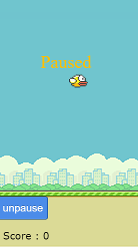

# Falling Bird

[live demo](https://jthaxton.github.io/FallingBird/FallingBird/index.html)

## Background
Falling Bird is a game based on Flappy Bird where users use the arrow keys to control a falling bird and try to avoid platforms on the way down.

## Functionality
* The bird moves right at the start of the game
* Users can press the Z key change the bird's direction
* Platforms generate randomly
* Falling speed increases as time passes
* Game over upon collision

## Technology
* Vanilla JavaScript for game logic 
* HTML5 Canvas for DOM manipulation/rendering 

## Architecture 
* index.html: this containst the canvas
* fallingbird.js: this will handle falling speed
* images: contains sprite files
* sounds: contains mp3 files


## Timeline 
10/29: 
 
- [ ] Finish brainstorming and proposal
- [ ] Begin skeleton

10/30:
- [ ] Finish skeleton
- [ ] Render background and/or sprite

10/31:
- [ ] Implement platforms/obstacles
- [ ] Create game over

11/1:
- [ ] Implement score
- [ ] Implement change in game speed over time

11/2:
- [ ] Additional features

## Additional features
* Hard mode:
  * Falling bird accellerates faster
  * Platforms are larger
* Upgrades:
  * Immunity: Falling bird hits immunity item and briefly is able to fall through platforms without causing game over
  * Point bonus: Falling bird gains bonus points

## Screenshot


## Sample code
I used the code below to create game over conditions (i.e. collisions):

```
function draw(){
    ...
    for(let i = 0; i < pipe.length; i++){
    ...
        if (bX <= pipe[i].x + pipeNorth.width && 
        (bY + bird.height <= pipe[i].y + pipeNorth.height) &&
        (bY + bird.height >= pipe[i].y) ||
        (bX + bird.width >= pipe[i].x + constant) &&
        (bY + bird.height <= pipe[i].y + pipeNorth.height) &&
        (bY + bird.height >= pipe[i].y ) || 
        bX + bird.width >= 285 || bX <= 0 ) {
        location.reload();
        }
```
Simply put, this expression checks to see if the bird's coordinates intersect with pipes or with the map borders.
